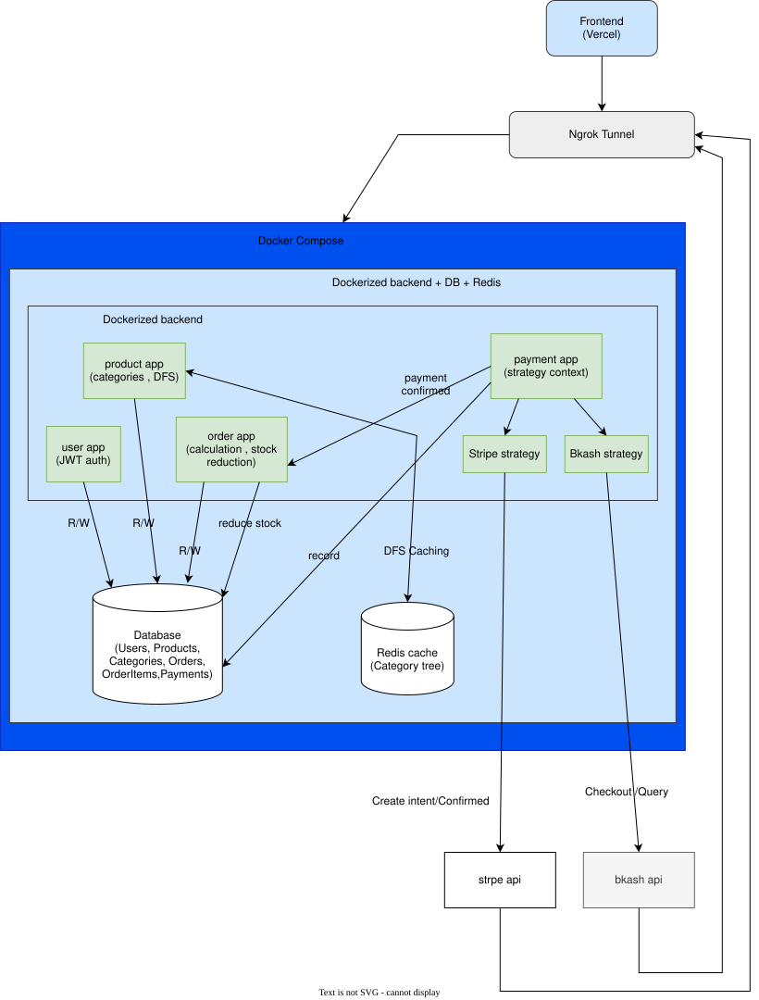
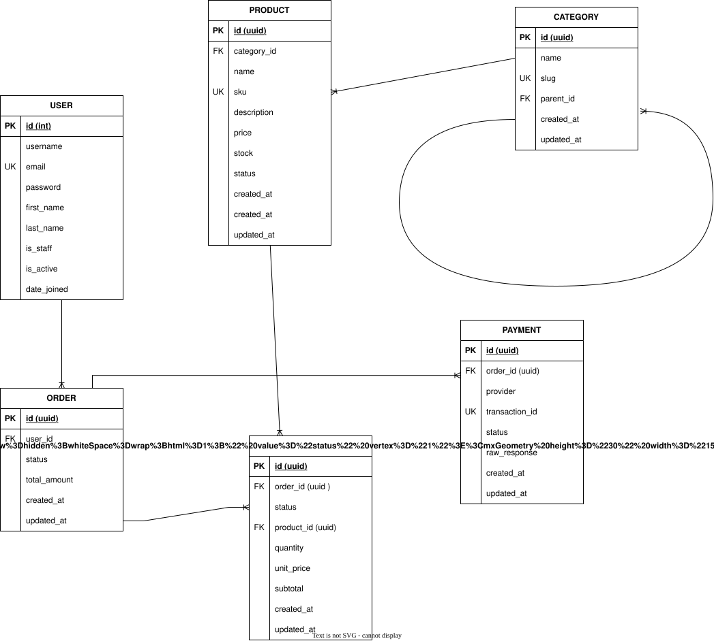
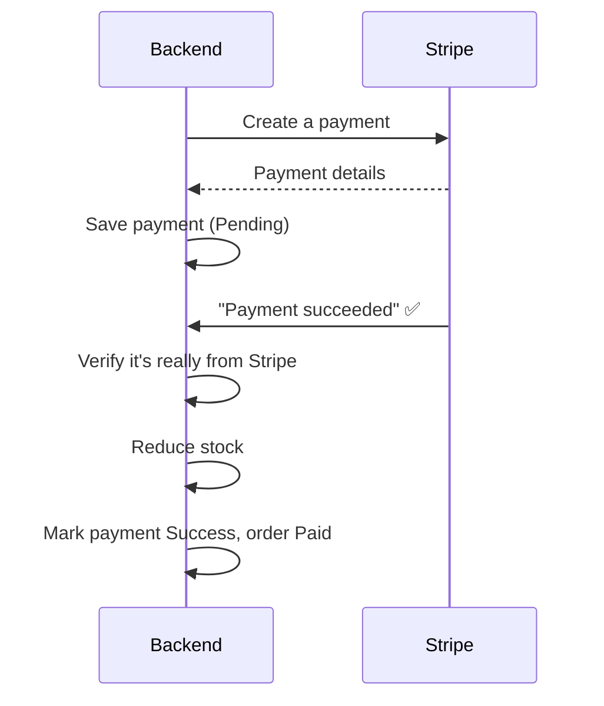
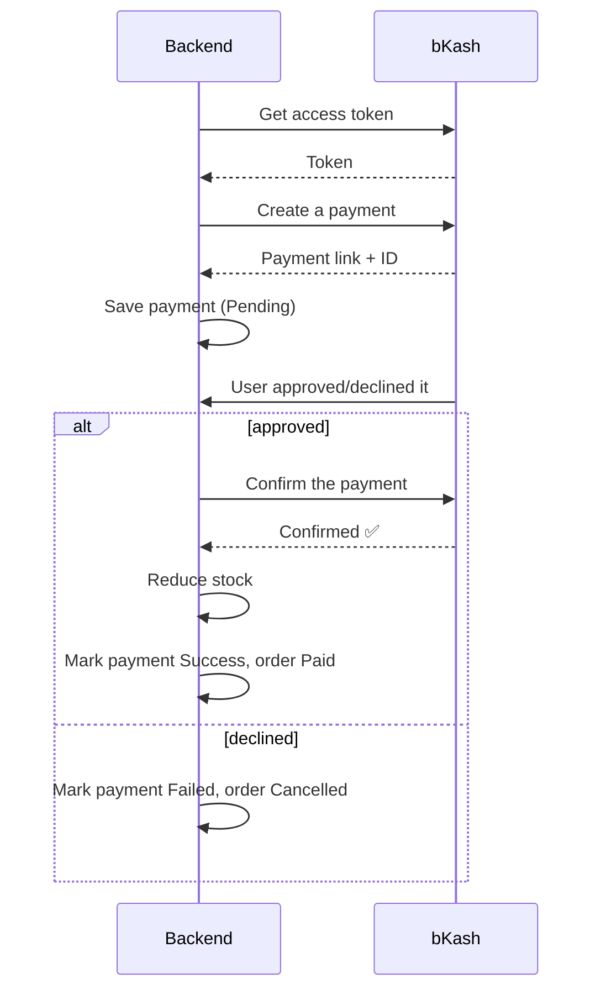

# E-commerce Ordering & Payment System

A Django REST Framework backend for an online store — user accounts, a product/category
catalog, order management, and checkout through **two** payment providers: **Stripe**
and **bKash**. It's built around a few deliberate design choices (a Strategy pattern for
payments, DFS + Redis caching for category recommendations, server-side-only totals)
that are explained below, along with the actual problems I ran into while building it
and how I solved them.

A small plain HTML/CSS/JS frontend is included and deployed at:
**https://ecommerce-payment-theta.vercel.app/**

---

## 1. What this project actually does

- **Users**: register/login with JWT, unique email, view your own orders and payments.
- **Products & Categories**: full CRUD for admins, a hierarchical category tree, and a
  "related products" recommendation endpoint.
- **Orders**: multi-item orders with server-computed totals, and race-condition-safe
  stock handling — two people can't oversell the last item in stock.
- **Payments**: checkout through **Stripe** or **bKash**, with webhook/callback
  handling that updates order status automatically once a payment actually completes.

## 2. Architecture

Feature-based app layout — each domain (`users`, `products`, `orders`, `payments`) is
self-contained with its own models, serializers, views, services, and tests.



```
config/            Django project: settings, root urls
apps/
├── common/         Shared BaseModel (UUID id, timestamps), custom exception handler
├── users/          Custom User (email login), JWT auth, profile
├── products/        Product, Category, DFS recommendations + Redis caching
├── orders/          Order, OrderItem, deterministic totals, safe stock reduction
└── payments/        Payment, Strategy pattern, Stripe + bKash integrations
frontend/           Plain HTML/CSS/JS client (deployed on Vercel)
docs/               Diagrams, payment flow docs, Postman collection
```

## 3. ERD



Every table besides `User` inherits a shared `BaseModel` (UUID primary key,
`created_at`, `updated_at`). `Category` is self-referencing (`parent`), which is what
makes the category tree hierarchical. `Payment` stores `provider`, a unique
`transaction_id`, `status`, and the full `raw_response` from whichever provider
handled it, so nothing about a payment's history is ever lost.

## 4. Payment Flow

**Stripe** — the backend opens a PaymentIntent, the card is confirmed entirely on the
frontend (Stripe Elements, card data never touches this server), and a signed webhook
tells the backend the result:



**bKash** — no client SDK; the browser is handed off to bKash's own hosted page, and
bKash redirects back once the user approves or declines:



In both cases, **stock is only reduced after a payment actually succeeds** — never at
order creation — so an abandoned or failed checkout never touches inventory.

## 5. Why these design choices

**Strategy pattern for payments** (`apps/payments/strategies/`) — `PaymentService`
picks a provider by a simple string lookup (`{"stripe": StripeStrategy, "bkash":
BkashStrategy}`), and every strategy implements the same three-method interface
(`initiate`, `confirm`, `verify`). Nothing in `OrderService` or the views ever
branches on which provider is being used. Adding a third provider later — say,
Nagad — means writing one new strategy class and registering it in that dictionary;
zero changes to existing order or checkout logic.

**DFS + Redis caching for categories** (`apps/products/services.py`) — the category
tree is a self-referencing hierarchy, so building "here's this product's category and
everything related to it" naturally wants a depth-first traversal. Since that tree
rarely changes but gets read constantly (every product page hits it), the serialized
tree is cached in Redis and only invalidated when a category is actually
created/updated/deleted — so most requests never touch the database for this at all.

**Deterministic, server-side totals** (`apps/orders/services.py`) — `calculate_totals`
always recomputes quantity × price from the database, never trusts a total the
client sends. Combined with `select_for_update()` inside `transaction.atomic()` when
checking/reducing stock, two concurrent checkouts on the last unit of stock can't
both succeed — one wins, one gets a clean "insufficient stock" error instead of
silently overselling.

## 6. Setting up the payment providers

**Stripe** (test mode):

1. Create a free Stripe account, grab your **secret key** (`sk_test_...`) from
   Developers → API keys.
2. Add a webhook destination pointing at `<your-public-url>/api/payments/webhook/stripe/`
   (this needs a publicly reachable URL — see the ngrok section below), listening for
   `payment_intent.succeeded` and `payment_intent.payment_failed`. Copy its signing
   secret (`whsec_...`).
3. Put both into `.env` as `STRIPE_SECRET_KEY` and `STRIPE_WEBHOOK_SECRET`.
4. To actually push a test PaymentIntent to "succeeded" without a frontend, the Stripe
   CLI works well: `stripe payment_intents confirm pi_... --payment-method=pm_card_visa`.

**bKash** (sandbox):

1. Get sandbox credentials from bKash's developer portal — `BKASH_APP_KEY`,
   `BKASH_APP_SECRET`, `BKASH_USERNAME`, `BKASH_PASSWORD`.
2. `BKASH_BASE_URL` must be the **API** domain
   (`https://tokenized.sandbox.bka.sh/v1.2.0-beta`), not the customer-facing checkout
   domain — mixing these up is a very easy first mistake (see below).
3. Checkout returns a `bkashURL` — redirect the whole browser tab there; bKash
   redirects back to your callback URL once the user approves/declines on their own
   hosted page.

## 7. Problems I ran into, and how I solved them

This is the part I actually learned the most from — a payment integration touching
two external sandboxes, Docker, and Windows networking surfaces a lot of small, sharp
edges that don't show up in a tutorial.

**Environment variables don't reload themselves.** Editing `.env` while the backend
is already running does nothing — Django (and Docker) only read it once, at process
start. I hit this repeatedly early on: I'd fix a key, restart my terminal, and the old
value would still be in effect. The deeper trap turned out to be **`docker-compose
restart` vs `docker-compose up -d --force-recreate`** — a plain restart just restarts
the process inside the _same_ container, whose environment was already baked in when
the container was first created via `env_file`. Only a full recreate actually re-reads
`.env`. Cost me a fair bit of "why isn't my fix working" time until I found the
distinction.

**A genuinely confusing one: an orphaned `runserver` process.** After fixing an env
value, requests _still_ failed with the old error — even though a fresh terminal
confirmed Django had the right key. Turned out an earlier `runserver` process hadn't
actually died; it was still bound to port 8000 in the background with the stale
environment, while the terminal I was watching was a completely different, unused
process. Found it by checking which PID was _actually_ bound to the port
(`Get-NetTCPConnection -LocalPort 8000`) rather than trusting which terminal I assumed
was serving requests.

**Windows had silently reserved my dev port.** At one point Docker refused to bind
port 8000 at all — not because anything else was using it, but because Windows'
Hyper-V/WSL2 networking had claimed that exact port range for its own internal use.
Restarting the `winnat` service (the thing that manages those reservations) freed it
immediately, without needing a full reboot.

**bKash: wrong base URL, then a duplicated env key, then flaky sandbox behavior.**
First mistake was pointing `BKASH_BASE_URL` at the customer-facing checkout domain
instead of the actual API domain — got a misleading "invalid credentials" error that
had nothing to do with the credentials. Second, a copy-paste slip left the key name
duplicated inside its own value in `.env`. After fixing both, I still hit inconsistent
results from bKash's _sandbox itself_ — clean failures on their own documented
"success" test wallets, and even raw HTTP errors (401/403) on calls that had worked
moments earlier. I confirmed this wasn't my integration by cross-checking against
Stripe (architecturally identical, worked reliably every time) and by writing a
mocked test that proves the success path is handled correctly whenever bKash
_does_ return success — the sandbox's shared, publicly-used credentials being flaky
is a known, external limitation, not a code bug.

**Crashes instead of clean failures.** My first pass at error handling only expected
providers to reply with a normal response and a status field to check — it didn't
account for a provider call failing outright (a `403`, a dropped connection, a
timeout). A couple of real bKash sandbox errors exposed this as an actual unhandled
exception crashing the request instead of returning a clean error. Fixed by wrapping
every provider call in both `initiate()` and the confirm/webhook paths, catching the
broad `requests.RequestException` (covers bad status codes _and_ connection/timeout
failures) and Stripe's own `stripe.error.StripeError`, and consistently marking the
payment `failed` + the order `cancelled` either way through one shared helper.

**CORS and a self-inflicted follow-up.** Deploying the frontend to Vercel meant every
request became cross-origin, and free-tier **ngrok** adds its own wrinkle: it shows a
browser-warning interstitial page (plain text, not JSON) to any request that looks
like it's coming from a browser. The fix — sending a custom header to bypass it —
then broke CORS preflight itself, since a non-default custom header has to be
explicitly allowed via `CORS_ALLOW_HEADERS`, or the browser blocks the real request
before it's even sent. Good reminder that fixing one integration issue can quietly
introduce another one layer up.

## 8. Getting started (backend)

```bash
git clone https://github.com/Nafis-Rohan/EcommercePayment.git
cd EcommercePayment
python -m venv .venv
.venv\Scripts\activate        # Windows
pip install -r requirements.txt

cp .env.example .env           # then fill in real values (see .env.example)

docker-compose up -d           # Postgres + Redis + backend, all three
docker exec ecommerce_backend python manage.py migrate
docker exec ecommerce_backend python manage.py seed_admin
docker exec ecommerce_backend python manage.py seed_products
```

Backend is now running at `http://localhost:8000`. A Postman collection is included
at `docs/postman_collection.json` for exercising every endpoint directly, and the
published, browsable version is here:
**https://documenter.getpostman.com/view/47893159/2sBY4SLJMb**

## 9. Exposing it publicly with ngrok

Stripe's webhook and a deployed frontend both need a real, public URL to reach a
backend that's only running on `localhost`. [ngrok](https://ngrok.com) creates a
secure tunnel to your local port:

```bash
ngrok config add-authtoken <your-authtoken-from-the-ngrok-dashboard>
ngrok http 8000
```

This prints a forwarding line that looks like:

```
Forwarding    https://detonator-folk-claw.ngrok-free.dev -> http://localhost:8000
```

That `https://...ngrok-free.dev` URL is now a real, internet-reachable address for
your local backend — use it as the Stripe webhook destination, and as `API_BASE_URL`
in `frontend/js/config.js`. Free-tier ngrok assigns a new random URL every time you
restart it, so both of those need updating whenever that happens. Also remember to
add whatever origin you're serving the frontend from (and the ngrok URL itself, if
your setup calls for it) to `CORS_ALLOWED_ORIGINS` in `.env` — and recreate the
backend container, not just restart it, for that to take effect.

## 10. Frontend

Plain HTML/CSS/JS, no framework, no build step — deployed as a static site on Vercel.

**Live**: https://ecommerce-payment-theta.vercel.app/

To run it yourself, pointed at your own backend:

```bash
cd frontend
python -m http.server 5500
```

Then open `http://localhost:5500/index.html`. Before it'll actually talk to your
backend, update `frontend/js/config.js`:

- `API_BASE_URL` → your backend's public URL (ngrok, or wherever it's deployed) + `/api`
- `STRIPE_PUBLISHABLE_KEY` → your Stripe **publishable** key (`pk_test_...`, safe to
  expose client-side — never the secret key)

And make sure whatever origin you're serving it from is added to
`CORS_ALLOWED_ORIGINS` in the backend's `.env`.

## 11. Tests

```bash
docker exec ecommerce_backend python manage.py test
```

Covers model unit tests, API tests for auth/orders/payments, a threaded concurrency
test proving the stock race-condition fix actually works, and webhook/callback tests
for both providers with the provider calls mocked out.
