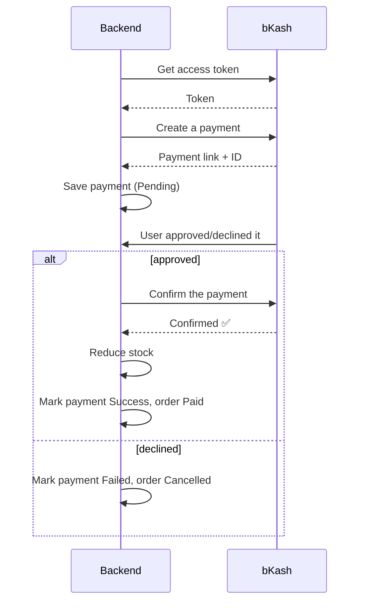

# Payment Flow — bKash (backend flow)

**In plain words:** the backend logs into bKash and starts a payment, saving it as
Pending. Once bKash reports whether the user approved or declined it, the backend
either confirms the payment and marks the order Paid, or marks it Failed/Cancelled.
