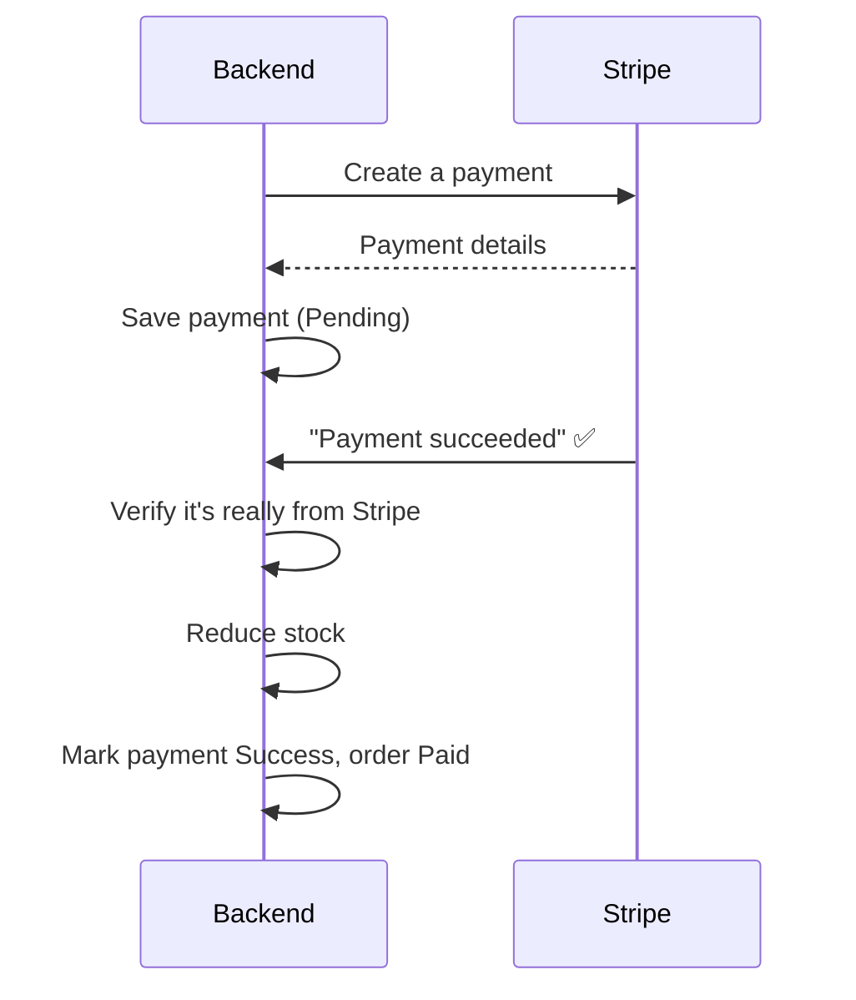

# Payment Flow — Stripe (backend flow)

**In plain words:** the backend asks Stripe to start a payment and saves it as
Pending. Later, Stripe notifies the backend the payment succeeded; the backend
checks that notification is genuine, then reduces stock and marks the order Paid.
